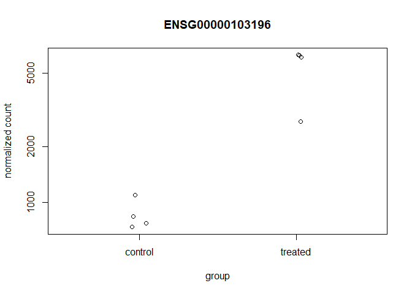
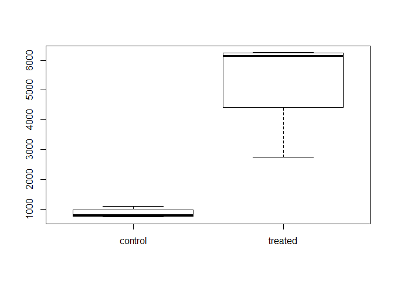
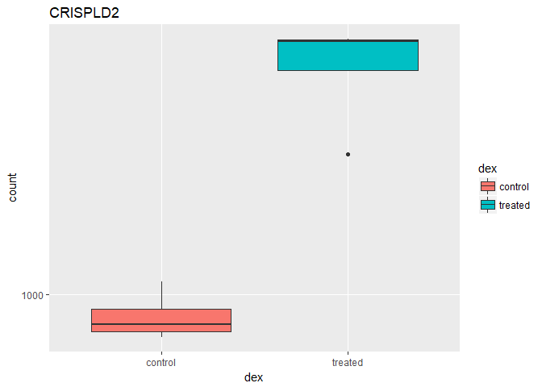
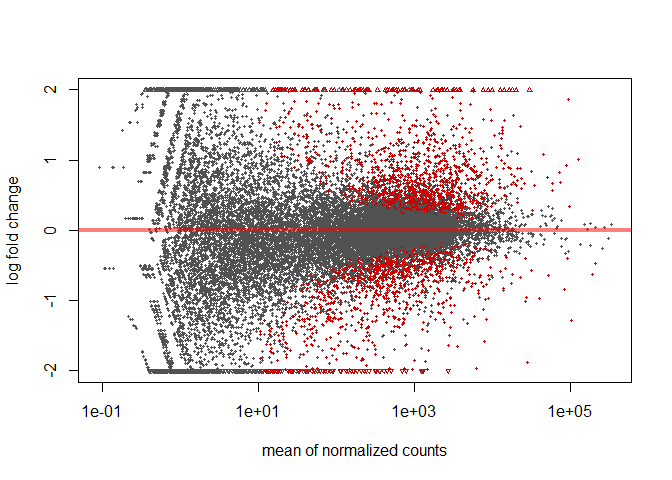
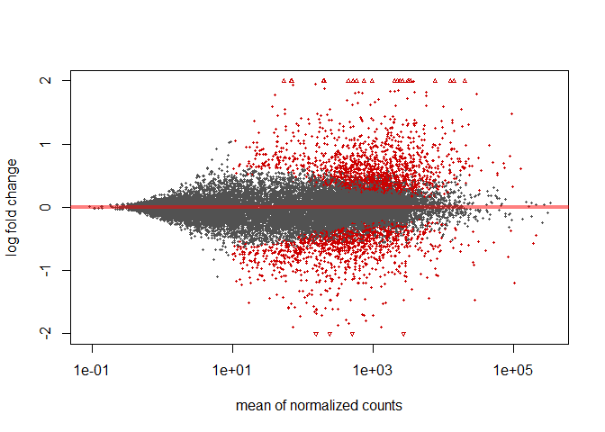
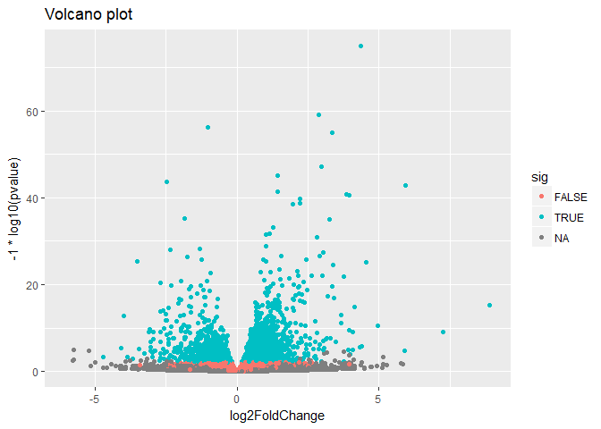

BGGN\_213\_class14
================

Transcriptomics and RNA-Seq data
================================

count matrix and meta-data matrix

``` r
counts <- read.csv("Data/airway_scaledcounts.csv", stringsAsFactors = FALSE)
metadata <-  read.csv("Data/airway_metadata.csv", stringsAsFactors = FALSE)
head(counts)
```

    ##           ensgene SRR1039508 SRR1039509 SRR1039512 SRR1039513 SRR1039516
    ## 1 ENSG00000000003        723        486        904        445       1170
    ## 2 ENSG00000000005          0          0          0          0          0
    ## 3 ENSG00000000419        467        523        616        371        582
    ## 4 ENSG00000000457        347        258        364        237        318
    ## 5 ENSG00000000460         96         81         73         66        118
    ## 6 ENSG00000000938          0          0          1          0          2
    ##   SRR1039517 SRR1039520 SRR1039521
    ## 1       1097        806        604
    ## 2          0          0          0
    ## 3        781        417        509
    ## 4        447        330        324
    ## 5         94        102         74
    ## 6          0          0          0

``` r
head(metadata)
```

    ##           id     dex celltype     geo_id
    ## 1 SRR1039508 control   N61311 GSM1275862
    ## 2 SRR1039509 treated   N61311 GSM1275863
    ## 3 SRR1039512 control  N052611 GSM1275866
    ## 4 SRR1039513 treated  N052611 GSM1275867
    ## 5 SRR1039516 control  N080611 GSM1275870
    ## 6 SRR1039517 treated  N080611 GSM1275871

``` r
colnames(counts)[-1] == metadata$id
```

    ## [1] TRUE TRUE TRUE TRUE TRUE TRUE TRUE TRUE

Toy differential gene expression
================================

Lets perform some exploratory differential gene expression analysis. Note: this analysis is for demonstration only. NEVER do differential expression analysis this way!

Calculate mean counts for each gene across control samples

``` r
control <- metadata[metadata[,"dex"]=="control",]
control.mean <- rowSums( counts[ ,control$id] )/nrow(control) 
names(control.mean) <- counts$ensgene
head(control.mean)
```

    ## ENSG00000000003 ENSG00000000005 ENSG00000000419 ENSG00000000457 
    ##          900.75            0.00          520.50          339.75 
    ## ENSG00000000460 ENSG00000000938 
    ##           97.25            0.75

Calculate mean counts for each gene across treated samples

``` r
treated <- metadata[metadata[,"dex"]=="treated",]
treated.mean <- rowSums( counts[ ,treated$id] )/nrow(treated) 
names(treated.mean) <- counts$ensgene
head(treated.mean)
```

    ## ENSG00000000003 ENSG00000000005 ENSG00000000419 ENSG00000000457 
    ##          658.00            0.00          546.00          316.50 
    ## ENSG00000000460 ENSG00000000938 
    ##           78.75            0.00

``` r
meancounts <- data.frame(control.mean, treated.mean)
head(meancounts)
```

    ##                 control.mean treated.mean
    ## ENSG00000000003       900.75       658.00
    ## ENSG00000000005         0.00         0.00
    ## ENSG00000000419       520.50       546.00
    ## ENSG00000000457       339.75       316.50
    ## ENSG00000000460        97.25        78.75
    ## ENSG00000000938         0.75         0.00

plot mean counts for control vs treated
=======================================

``` r
plot(meancounts$control, meancounts$treated,
     xlab="Control", ylab="Treated"
     )
```

 plot with log axis to see more of data

``` r
plot(meancounts$control, meancounts$treated, log="xy",
     xlab="Control", ylab="Treated"
     )
```

    ## Warning in xy.coords(x, y, xlabel, ylabel, log): 15032 x values <= 0
    ## omitted from logarithmic plot

    ## Warning in xy.coords(x, y, xlabel, ylabel, log): 15281 y values <= 0
    ## omitted from logarithmic plot


``` r
meancounts$log2fc <- log2(meancounts[,"treated.mean"]/meancounts[,"control.mean"])
head(meancounts)
```

    ##                 control.mean treated.mean      log2fc
    ## ENSG00000000003       900.75       658.00 -0.45303916
    ## ENSG00000000005         0.00         0.00         NaN
    ## ENSG00000000419       520.50       546.00  0.06900279
    ## ENSG00000000457       339.75       316.50 -0.10226805
    ## ENSG00000000460        97.25        78.75 -0.30441833
    ## ENSG00000000938         0.75         0.00        -Inf

removing NA and -Inf values (from attempting to divdie by 0 and attempting to take log of 0)

``` r
zero.vals <- which(meancounts[,1:2]==0, arr.ind=TRUE)

head(zero.vals)
```

    ##                 row col
    ## ENSG00000000005   2   1
    ## ENSG00000004848  65   1
    ## ENSG00000004948  70   1
    ## ENSG00000005001  73   1
    ## ENSG00000006059 121   1
    ## ENSG00000006071 123   1

``` r
to.rm <- unique(zero.vals[,1])
mycounts <- meancounts[-to.rm,]
head(mycounts)
```

    ##                 control.mean treated.mean      log2fc
    ## ENSG00000000003       900.75       658.00 -0.45303916
    ## ENSG00000000419       520.50       546.00  0.06900279
    ## ENSG00000000457       339.75       316.50 -0.10226805
    ## ENSG00000000460        97.25        78.75 -0.30441833
    ## ENSG00000000971      5219.00      6687.50  0.35769358
    ## ENSG00000001036      2327.00      1785.75 -0.38194109

Checking for 2 fold change
==========================

``` r
up.ind <- mycounts$log2fc > 2
down.ind <- mycounts$log2fc < (-2)

paste("Up:", sum(up.ind))
```

    ## [1] "Up: 250"

``` r
paste("Down:", sum(down.ind))
```

    ## [1] "Down: 367"

Annotation
==========

``` r
anno <- read.csv("Data/annotables_grch38.csv")
head(anno)
```

    ##           ensgene entrez   symbol chr     start       end strand
    ## 1 ENSG00000000003   7105   TSPAN6   X 100627109 100639991     -1
    ## 2 ENSG00000000005  64102     TNMD   X 100584802 100599885      1
    ## 3 ENSG00000000419   8813     DPM1  20  50934867  50958555     -1
    ## 4 ENSG00000000457  57147    SCYL3   1 169849631 169894267     -1
    ## 5 ENSG00000000460  55732 C1orf112   1 169662007 169854080      1
    ## 6 ENSG00000000938   2268      FGR   1  27612064  27635277     -1
    ##          biotype
    ## 1 protein_coding
    ## 2 protein_coding
    ## 3 protein_coding
    ## 4 protein_coding
    ## 5 protein_coding
    ## 6 protein_coding
    ##                                                                                                  description
    ## 1                                                          tetraspanin 6 [Source:HGNC Symbol;Acc:HGNC:11858]
    ## 2                                                            tenomodulin [Source:HGNC Symbol;Acc:HGNC:17757]
    ## 3 dolichyl-phosphate mannosyltransferase polypeptide 1, catalytic subunit [Source:HGNC Symbol;Acc:HGNC:3005]
    ## 4                                               SCY1-like, kinase-like 3 [Source:HGNC Symbol;Acc:HGNC:19285]
    ## 5                                    chromosome 1 open reading frame 112 [Source:HGNC Symbol;Acc:HGNC:25565]
    ## 6                          FGR proto-oncogene, Src family tyrosine kinase [Source:HGNC Symbol;Acc:HGNC:3697]

``` r
results <- merge(mycounts, anno, by.x="row.names", by.y="ensgene")
head(results)
```

    ##         Row.names control.mean treated.mean      log2fc entrez   symbol
    ## 1 ENSG00000000003       900.75       658.00 -0.45303916   7105   TSPAN6
    ## 2 ENSG00000000419       520.50       546.00  0.06900279   8813     DPM1
    ## 3 ENSG00000000457       339.75       316.50 -0.10226805  57147    SCYL3
    ## 4 ENSG00000000460        97.25        78.75 -0.30441833  55732 C1orf112
    ## 5 ENSG00000000971      5219.00      6687.50  0.35769358   3075      CFH
    ## 6 ENSG00000001036      2327.00      1785.75 -0.38194109   2519    FUCA2
    ##   chr     start       end strand        biotype
    ## 1   X 100627109 100639991     -1 protein_coding
    ## 2  20  50934867  50958555     -1 protein_coding
    ## 3   1 169849631 169894267     -1 protein_coding
    ## 4   1 169662007 169854080      1 protein_coding
    ## 5   1 196651878 196747504      1 protein_coding
    ## 6   6 143494811 143511690     -1 protein_coding
    ##                                                                                                  description
    ## 1                                                          tetraspanin 6 [Source:HGNC Symbol;Acc:HGNC:11858]
    ## 2 dolichyl-phosphate mannosyltransferase polypeptide 1, catalytic subunit [Source:HGNC Symbol;Acc:HGNC:3005]
    ## 3                                               SCY1-like, kinase-like 3 [Source:HGNC Symbol;Acc:HGNC:19285]
    ## 4                                    chromosome 1 open reading frame 112 [Source:HGNC Symbol;Acc:HGNC:25565]
    ## 5                                                     complement factor H [Source:HGNC Symbol;Acc:HGNC:4883]
    ## 6                                          fucosidase, alpha-L- 2, plasma [Source:HGNC Symbol;Acc:HGNC:4008]

Different Annotation
====================

``` r
library(org.Hs.eg.db)
```

    ## Loading required package: AnnotationDbi

    ## Loading required package: stats4

    ## Loading required package: BiocGenerics

    ## Loading required package: parallel

    ## 
    ## Attaching package: 'BiocGenerics'

    ## The following objects are masked from 'package:parallel':
    ## 
    ##     clusterApply, clusterApplyLB, clusterCall, clusterEvalQ,
    ##     clusterExport, clusterMap, parApply, parCapply, parLapply,
    ##     parLapplyLB, parRapply, parSapply, parSapplyLB

    ## The following objects are masked from 'package:stats':
    ## 
    ##     IQR, mad, sd, var, xtabs

    ## The following objects are masked from 'package:base':
    ## 
    ##     anyDuplicated, append, as.data.frame, cbind, colMeans,
    ##     colnames, colSums, do.call, duplicated, eval, evalq, Filter,
    ##     Find, get, grep, grepl, intersect, is.unsorted, lapply,
    ##     lengths, Map, mapply, match, mget, order, paste, pmax,
    ##     pmax.int, pmin, pmin.int, Position, rank, rbind, Reduce,
    ##     rowMeans, rownames, rowSums, sapply, setdiff, sort, table,
    ##     tapply, union, unique, unsplit, which, which.max, which.min

    ## Loading required package: Biobase

    ## Welcome to Bioconductor
    ## 
    ##     Vignettes contain introductory material; view with
    ##     'browseVignettes()'. To cite Bioconductor, see
    ##     'citation("Biobase")', and for packages 'citation("pkgname")'.

    ## Loading required package: IRanges

    ## Loading required package: S4Vectors

    ## 
    ## Attaching package: 'S4Vectors'

    ## The following object is masked from 'package:base':
    ## 
    ##     expand.grid

    ## 

``` r
columns(org.Hs.eg.db)
```

    ##  [1] "ACCNUM"       "ALIAS"        "ENSEMBL"      "ENSEMBLPROT" 
    ##  [5] "ENSEMBLTRANS" "ENTREZID"     "ENZYME"       "EVIDENCE"    
    ##  [9] "EVIDENCEALL"  "GENENAME"     "GO"           "GOALL"       
    ## [13] "IPI"          "MAP"          "OMIM"         "ONTOLOGY"    
    ## [17] "ONTOLOGYALL"  "PATH"         "PFAM"         "PMID"        
    ## [21] "PROSITE"      "REFSEQ"       "SYMBOL"       "UCSCKG"      
    ## [25] "UNIGENE"      "UNIPROT"

``` r
mycounts$symbol <- mapIds(org.Hs.eg.db,
                     keys=row.names(mycounts),
                     column="SYMBOL",
                     keytype="ENSEMBL",
                     multiVals="first")
```

    ## 'select()' returned 1:many mapping between keys and columns

``` r
head(mycounts)
```

    ##                 control.mean treated.mean      log2fc   symbol
    ## ENSG00000000003       900.75       658.00 -0.45303916   TSPAN6
    ## ENSG00000000419       520.50       546.00  0.06900279     DPM1
    ## ENSG00000000457       339.75       316.50 -0.10226805    SCYL3
    ## ENSG00000000460        97.25        78.75 -0.30441833 C1orf112
    ## ENSG00000000971      5219.00      6687.50  0.35769358      CFH
    ## ENSG00000001036      2327.00      1785.75 -0.38194109    FUCA2

``` r
head(mycounts[up.ind,])
```

    ##                 control.mean treated.mean   log2fc  symbol
    ## ENSG00000004799       270.50      1429.25 2.401558    PDK4
    ## ENSG00000006788         2.75        19.75 2.844349   MYH13
    ## ENSG00000008438         0.50         2.75 2.459432 PGLYRP1
    ## ENSG00000011677         0.50         2.25 2.169925  GABRA3
    ## ENSG00000015413         0.50         3.00 2.584963   DPEP1
    ## ENSG00000015592         0.50         2.25 2.169925   STMN4

DESeq2 Analysis
===============

``` r
library(DESeq2)
```

    ## Loading required package: GenomicRanges

    ## Loading required package: GenomeInfoDb

    ## Loading required package: SummarizedExperiment

    ## Loading required package: DelayedArray

    ## Loading required package: matrixStats

    ## 
    ## Attaching package: 'matrixStats'

    ## The following objects are masked from 'package:Biobase':
    ## 
    ##     anyMissing, rowMedians

    ## 
    ## Attaching package: 'DelayedArray'

    ## The following objects are masked from 'package:matrixStats':
    ## 
    ##     colMaxs, colMins, colRanges, rowMaxs, rowMins, rowRanges

    ## The following object is masked from 'package:base':
    ## 
    ##     apply

``` r
dds <- DESeqDataSetFromMatrix(countData=counts, 
                              colData=metadata, 
                              design=~dex, 
                              tidy=TRUE)
```

    ## converting counts to integer mode

    ## Warning in DESeqDataSet(se, design = design, ignoreRank): some variables in
    ## design formula are characters, converting to factors

``` r
dds
```

    ## class: DESeqDataSet 
    ## dim: 38694 8 
    ## metadata(1): version
    ## assays(1): counts
    ## rownames(38694): ENSG00000000003 ENSG00000000005 ...
    ##   ENSG00000283120 ENSG00000283123
    ## rowData names(0):
    ## colnames(8): SRR1039508 SRR1039509 ... SRR1039520 SRR1039521
    ## colData names(4): id dex celltype geo_id

``` r
dds <- DESeq(dds)
```

    ## estimating size factors

    ## estimating dispersions

    ## gene-wise dispersion estimates

    ## mean-dispersion relationship

    ## final dispersion estimates

    ## fitting model and testing

``` r
res <- results(dds)
res
```

    ## log2 fold change (MLE): dex treated vs control 
    ## Wald test p-value: dex treated vs control 
    ## DataFrame with 38694 rows and 6 columns
    ##                  baseMean log2FoldChange     lfcSE       stat     pvalue
    ##                 <numeric>      <numeric> <numeric>  <numeric>  <numeric>
    ## ENSG00000000003 747.19420    -0.35070283 0.1682342 -2.0846111 0.03710462
    ## ENSG00000000005   0.00000             NA        NA         NA         NA
    ## ENSG00000000419 520.13416     0.20610652 0.1010134  2.0403876 0.04131173
    ## ENSG00000000457 322.66484     0.02452714 0.1451103  0.1690242 0.86577762
    ## ENSG00000000460  87.68263    -0.14714409 0.2569657 -0.5726216 0.56690095
    ## ...                   ...            ...       ...        ...        ...
    ## ENSG00000283115  0.000000             NA        NA         NA         NA
    ## ENSG00000283116  0.000000             NA        NA         NA         NA
    ## ENSG00000283119  0.000000             NA        NA         NA         NA
    ## ENSG00000283120  0.974916     -0.6682308  1.694063 -0.3944544  0.6932456
    ## ENSG00000283123  0.000000             NA        NA         NA         NA
    ##                      padj
    ##                 <numeric>
    ## ENSG00000000003 0.1630257
    ## ENSG00000000005        NA
    ## ENSG00000000419 0.1757326
    ## ENSG00000000457 0.9616577
    ## ENSG00000000460 0.8157061
    ## ...                   ...
    ## ENSG00000283115        NA
    ## ENSG00000283116        NA
    ## ENSG00000283119        NA
    ## ENSG00000283120        NA
    ## ENSG00000283123        NA

``` r
summary(res)
```

    ## 
    ## out of 25258 with nonzero total read count
    ## adjusted p-value < 0.1
    ## LFC > 0 (up)     : 1564, 6.2% 
    ## LFC < 0 (down)   : 1188, 4.7% 
    ## outliers [1]     : 142, 0.56% 
    ## low counts [2]   : 9971, 39% 
    ## (mean count < 10)
    ## [1] see 'cooksCutoff' argument of ?results
    ## [2] see 'independentFiltering' argument of ?results

Order results by p-value

``` r
resOrdered <- res[order(res$pvalue),]
head(resOrdered)
```

    ## log2 fold change (MLE): dex treated vs control 
    ## Wald test p-value: dex treated vs control 
    ## DataFrame with 6 rows and 6 columns
    ##                   baseMean log2FoldChange      lfcSE      stat
    ##                  <numeric>      <numeric>  <numeric> <numeric>
    ## ENSG00000152583   954.7709       4.368359 0.23713648  18.42129
    ## ENSG00000179094   743.2527       2.863888 0.17555825  16.31304
    ## ENSG00000116584  2277.9135      -1.034700 0.06505273 -15.90556
    ## ENSG00000189221  2383.7537       3.341544 0.21241508  15.73120
    ## ENSG00000120129  3440.7038       2.965211 0.20370277  14.55656
    ## ENSG00000148175 13493.9204       1.427168 0.10036663  14.21955
    ##                       pvalue         padj
    ##                    <numeric>    <numeric>
    ## ENSG00000152583 8.867079e-76 1.342919e-71
    ## ENSG00000179094 7.972621e-60 6.037268e-56
    ## ENSG00000116584 5.798513e-57 2.927283e-53
    ## ENSG00000189221 9.244206e-56 3.500088e-52
    ## ENSG00000120129 5.306416e-48 1.607313e-44
    ## ENSG00000148175 6.929711e-46 1.749175e-42

``` r
res05 <- results(dds, alpha=0.05)
summary(res05)
```

    ## 
    ## out of 25258 with nonzero total read count
    ## adjusted p-value < 0.05
    ## LFC > 0 (up)     : 1237, 4.9% 
    ## LFC < 0 (down)   : 933, 3.7% 
    ## outliers [1]     : 142, 0.56% 
    ## low counts [2]   : 9033, 36% 
    ## (mean count < 6)
    ## [1] see 'cooksCutoff' argument of ?results
    ## [2] see 'independentFiltering' argument of ?results

``` r
resSig05 <- subset(as.data.frame(res), padj < 0.05)
nrow(resSig05)
```

    ## [1] 2182

``` r
resSig01 <- subset(as.data.frame(res), padj < 0.01)
nrow(resSig01)
```

    ## [1] 1437

``` r
ord <- order( resSig01$padj )
#View(res01[ord,])
head(resSig01[ord,])
```

    ##                   baseMean log2FoldChange      lfcSE      stat
    ## ENSG00000152583   954.7709       4.368359 0.23713648  18.42129
    ## ENSG00000179094   743.2527       2.863888 0.17555825  16.31304
    ## ENSG00000116584  2277.9135      -1.034700 0.06505273 -15.90556
    ## ENSG00000189221  2383.7537       3.341544 0.21241508  15.73120
    ## ENSG00000120129  3440.7038       2.965211 0.20370277  14.55656
    ## ENSG00000148175 13493.9204       1.427168 0.10036663  14.21955
    ##                       pvalue         padj
    ## ENSG00000152583 8.867079e-76 1.342919e-71
    ## ENSG00000179094 7.972621e-60 6.037268e-56
    ## ENSG00000116584 5.798513e-57 2.927283e-53
    ## ENSG00000189221 9.244206e-56 3.500088e-52
    ## ENSG00000120129 5.306416e-48 1.607313e-44
    ## ENSG00000148175 6.929711e-46 1.749175e-42

Annotate significant results

``` r
library(org.Hs.eg.db)
resSig01$symbol <- mapIds(org.Hs.eg.db,
                     keys=row.names(resSig01),
                     column="SYMBOL",
                     keytype="ENSEMBL",
                     multiVals="first")
```

    ## 'select()' returned 1:many mapping between keys and columns

``` r
head(resSig01)
```

    ##                  baseMean log2FoldChange      lfcSE      stat       pvalue
    ## ENSG00000002834 8609.1828      0.4168750 0.10827683  3.850085 1.180767e-04
    ## ENSG00000003096  414.0753     -0.9645789 0.19172945 -5.030937 4.880878e-07
    ## ENSG00000003402 3368.7234      1.1624996 0.12612244  9.217230 3.048738e-20
    ## ENSG00000004059 1684.3218      0.3796901 0.11417088  3.325630 8.821899e-04
    ## ENSG00000004487 1255.8003     -0.3341069 0.09600563 -3.480076 5.012723e-04
    ## ENSG00000004700 1510.2085      0.4095532 0.11914030  3.437570 5.869579e-04
    ##                         padj symbol
    ## ENSG00000002834 1.824767e-03  LASP1
    ## ENSG00000003096 1.490341e-05 KLHL13
    ## ENSG00000003402 7.859356e-18  CFLAR
    ## ENSG00000004059 9.389154e-03   ARF5
    ## ENSG00000004487 6.006146e-03  KDM1A
    ## ENSG00000004700 6.760059e-03  RECQL

Save significant results as a file

``` r
write.csv(resSig01[ord,], "signif01_results.csv")
```

visualize data
==============

``` r
i <- grep("CRISPLD2", resSig01$symbol)
resSig01[i,]
```

    ##                 baseMean log2FoldChange     lfcSE     stat       pvalue
    ## ENSG00000103196 3096.159       2.626034 0.2674705 9.818031 9.416441e-23
    ##                         padj   symbol
    ## ENSG00000103196 3.395524e-20 CRISPLD2

``` r
rownames(resSig01[i,])
```

    ## [1] "ENSG00000103196"

``` r
library(DESeq2)
plotCounts(dds, gene="ENSG00000103196", intgroup="dex")
```



``` r
# Return the data
d <- plotCounts(dds, gene="ENSG00000103196", intgroup="dex", returnData=TRUE)
head(d)
```

    ##                count     dex
    ## SRR1039508  774.5002 control
    ## SRR1039509 6258.7915 treated
    ## SRR1039512 1100.2741 control
    ## SRR1039513 6093.0324 treated
    ## SRR1039516  736.9483 control
    ## SRR1039517 2742.1908 treated

Boxplot

``` r
boxplot(count ~ dex , data=d)
```

 ggplot boxplot

``` r
library(ggplot2)
ggplot(d, aes(dex, count)) + geom_boxplot(aes(fill=dex)) + scale_y_log10() + ggtitle("CRISPLD2")
```

 \#MA and Volcano plots

``` r
res$sig <- res$padj<0.05

# How many of each?
table(res$sig)
```

    ## 
    ## FALSE  TRUE 
    ## 12963  2182

``` r
sum(is.na(res$sig))
```

    ## [1] 23549

``` r
library(DESeq2)
plotMA(res, ylim=c(-2,2))
```

 remove noise of low count genes

``` r
resLFC <- lfcShrink(dds, coef=2)
resLFC
```

    ## log2 fold change (MAP): dex treated vs control 
    ## Wald test p-value: dex treated vs control 
    ## DataFrame with 38694 rows and 6 columns
    ##                  baseMean log2FoldChange      lfcSE       stat     pvalue
    ##                 <numeric>      <numeric>  <numeric>  <numeric>  <numeric>
    ## ENSG00000000003 747.19420    -0.31838595 0.15271739 -2.0846111 0.03710462
    ## ENSG00000000005   0.00000             NA         NA         NA         NA
    ## ENSG00000000419 520.13416     0.19883048 0.09744556  2.0403876 0.04131173
    ## ENSG00000000457 322.66484     0.02280238 0.13491699  0.1690242 0.86577762
    ## ENSG00000000460  87.68263    -0.11887370 0.20772938 -0.5726216 0.56690095
    ## ...                   ...            ...        ...        ...        ...
    ## ENSG00000283115  0.000000             NA         NA         NA         NA
    ## ENSG00000283116  0.000000             NA         NA         NA         NA
    ## ENSG00000283119  0.000000             NA         NA         NA         NA
    ## ENSG00000283120  0.974916    -0.05944174  0.1514839 -0.3944544  0.6932456
    ## ENSG00000283123  0.000000             NA         NA         NA         NA
    ##                      padj
    ##                 <numeric>
    ## ENSG00000000003 0.1630257
    ## ENSG00000000005        NA
    ## ENSG00000000419 0.1757326
    ## ENSG00000000457 0.9616577
    ## ENSG00000000460 0.8157061
    ## ...                   ...
    ## ENSG00000283115        NA
    ## ENSG00000283116        NA
    ## ENSG00000283119        NA
    ## ENSG00000283120        NA
    ## ENSG00000283123        NA

``` r
plotMA(resLFC, ylim=c(-2,2))
```

 Volcano plots

``` r
library(ggplot2)
ggplot(as.data.frame(res), aes(log2FoldChange, -1*log10(pvalue), col=sig)) + 
    geom_point() + 
    ggtitle("Volcano plot")
```

    ## Warning: Removed 13578 rows containing missing values (geom_point).


