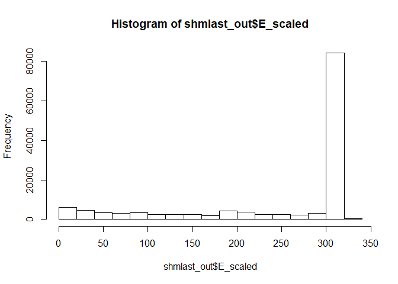
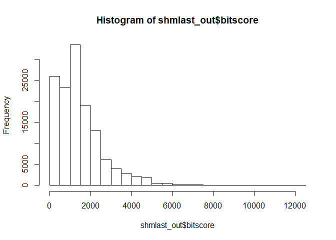
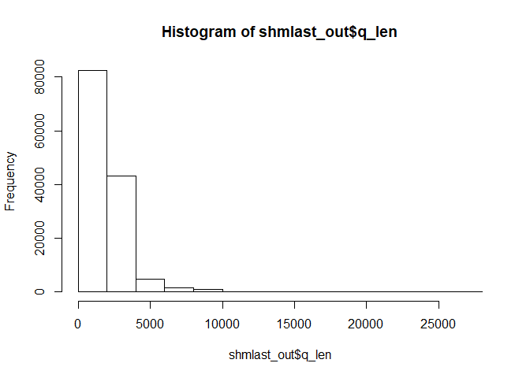
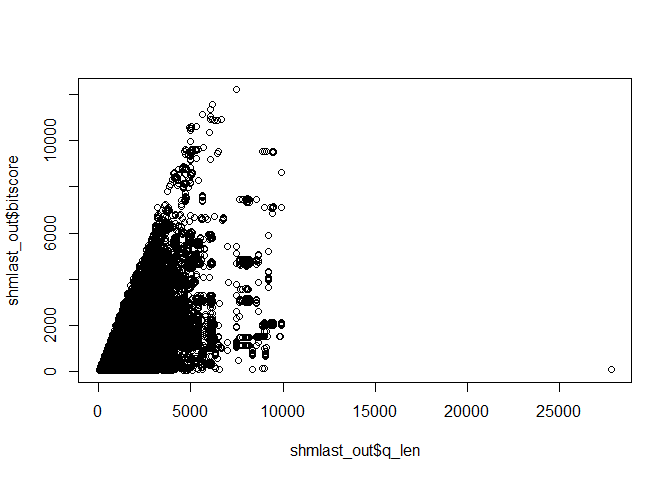

#Supercomputer Work

```r
download.file("https://raw.githubusercontent.com/ngs-docs/angus/17a0ba3b1d915de90a5b8bd1fbc1027eba47baf8/_static/shmlast/mouse.1.rna.fna.gz.x.cow.faa.crbl.csv.gz", "shmlast.csv")
shmlast_out <- read.csv("shmlast.csv")
```
#Histograms

```r
hist(shmlast_out$E_scaled)
```

<!-- -->


```r
hist(shmlast_out$bitscore)
```

<!-- -->


```r
hist(shmlast_out$q_len)
```

<!-- -->
#Plot query length vs bit score

```r
plot(shmlast_out$q_len, shmlast_out$bitscore)
```

<!-- -->
#Sampling from data

```r
shmlast_sub = shmlast_out[sample(nrow(shmlast_out), 10),]
head(shmlast_sub)
```

```
##               E      EG2 E_scaled      ID  bitscore q_aln_len q_frame
## 124047 2.6e-165 3.6e-158 164.5850  899378  582.8077       271       0
## 112639 7.4e-223 1.1e-215 222.1308  391662  773.9213       359       1
## 58920   0.0e+00 1.8e-300 307.6527  995360 1055.5159       510       1
## 2139   7.2e-248 2.0e-219 247.1427 1340769  786.2796       330       2
## 44972   0.0e+00  0.0e+00 307.6527  636202 1755.9715       852       0
## 65318   0.0e+00  0.0e+00 307.6527  285280 2459.0754      1389       1
##        q_len
## 124047  2950
## 112639  3348
## 58920    965
## 2139     614
## 44972   2386
## 65318   1591
##                                                                                                                                q_name
## 124047       ref|XM_006496878.3| PREDICTED: Mus musculus RAB GTPase activating protein 1-like (Rabgap1l), transcript variant X4, mRNA
## 112639     ref|XM_006525681.3| PREDICTED: Mus musculus 5 hydroxytryptamine (serotonin) receptor 4 (Htr4), transcript variant X5, mRNA
## 58920           ref|XM_011244226.2| PREDICTED: Mus musculus exonuclease 3'-5' domain containing 2 (Exd2), transcript variant X2, mRNA
## 2139   ref|XM_006525846.3| PREDICTED: Mus musculus LIM and senescent cell antigen like domains 2 (Lims2), transcript variant X2, mRNA
## 44972                   ref|XM_006523566.3| PREDICTED: Mus musculus collagen, type XI, alpha 2 (Col11a2), transcript variant X7, mRNA
## 65318                       ref|XM_006517432.2| PREDICTED: Mus musculus kinesin family member 27 (Kif27), transcript variant X6, mRNA
##        q_start q_strand s_aln_len s_len
## 124047     997        +       271   308
## 112639     659        +       373   402
## 58920       77        +       510   628
## 2139        67        +       330   336
## 44972      733        +       854  1510
## 65318      180        +      1385  1395
##                                                                                                                        s_name
## 124047                            ref|XP_010811785.1| PREDICTED: rab GTPase-activating protein 1-like isoform X2 [Bos taurus]
## 112639                                  ref|XP_010805725.1| PREDICTED: 5-hydroxytryptamine receptor 4 isoform X1 [Bos taurus]
## 58920                               ref|XP_015320685.1| PREDICTED: exonuclease 3'-5' domain-containing protein 2 [Bos taurus]
## 2139   ref|XP_015329901.1| PREDICTED: LIM and senescent cell antigen-like-containing domain protein 2 isoform X2 [Bos taurus]
## 44972                              ref|XP_015329224.1| PREDICTED: LOW QUALITY PROTEIN: collagen alpha-1(V) chain [Bos taurus]
## 65318                                       ref|XP_015328105.1| PREDICTED: kinesin-like protein KIF27 isoform X1 [Bos taurus]
##        s_start s_strand score
## 124047      37        +  1313
## 112639       0        +  1746
## 58920      118        +  2384
## 2139         0        +  1774
## 44972       13        +  3971
## 65318        0        +  5564
```
#Subset of data

```r
tmp <- subset(shmlast_out, q_len >= 8000 & q_len <= 11000 & bitscore <=2000)  
functions <- tmp[, c("q_name", "s_name")]
head(functions)
```

```
##                                                                                                                                 q_name
## 14567 ref|XM_017314045.1| PREDICTED: Mus musculus spectrin repeat containing, nuclear envelope 1 (Syne1), transcript variant X11, mRNA
## 14569 ref|XM_011243093.1| PREDICTED: Mus musculus spectrin repeat containing, nuclear envelope 1 (Syne1), transcript variant X13, mRNA
## 14570 ref|XM_017314046.1| PREDICTED: Mus musculus spectrin repeat containing, nuclear envelope 1 (Syne1), transcript variant X15, mRNA
## 14571 ref|XM_017314047.1| PREDICTED: Mus musculus spectrin repeat containing, nuclear envelope 1 (Syne1), transcript variant X16, mRNA
## 14622 ref|XM_011243091.2| PREDICTED: Mus musculus spectrin repeat containing, nuclear envelope 1 (Syne1), transcript variant X10, mRNA
## 14623 ref|XM_017314045.1| PREDICTED: Mus musculus spectrin repeat containing, nuclear envelope 1 (Syne1), transcript variant X11, mRNA
##                                                                 s_name
## 14567 ref|XP_010807813.1| PREDICTED: nesprin-2 isoform X4 [Bos taurus]
## 14569 ref|XP_010807813.1| PREDICTED: nesprin-2 isoform X4 [Bos taurus]
## 14570 ref|XP_010807813.1| PREDICTED: nesprin-2 isoform X4 [Bos taurus]
## 14571 ref|XP_010807813.1| PREDICTED: nesprin-2 isoform X4 [Bos taurus]
## 14622            ref|XP_015320348.1| PREDICTED: nesprin-1 [Bos taurus]
## 14623            ref|XP_015320348.1| PREDICTED: nesprin-1 [Bos taurus]
```

