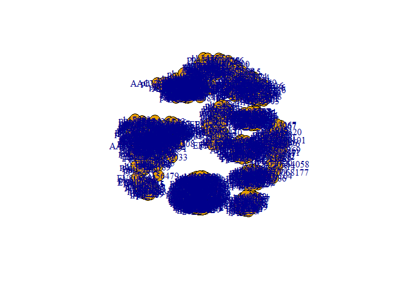
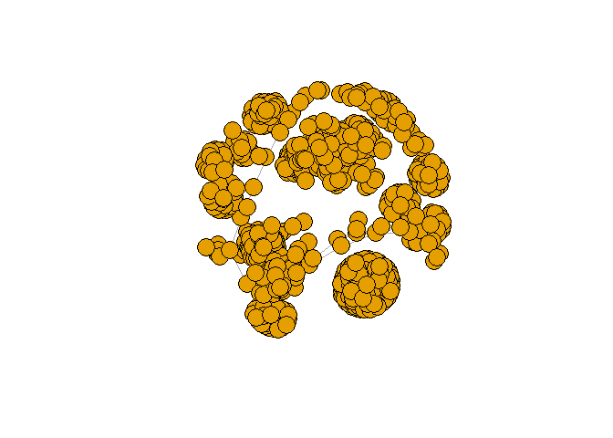
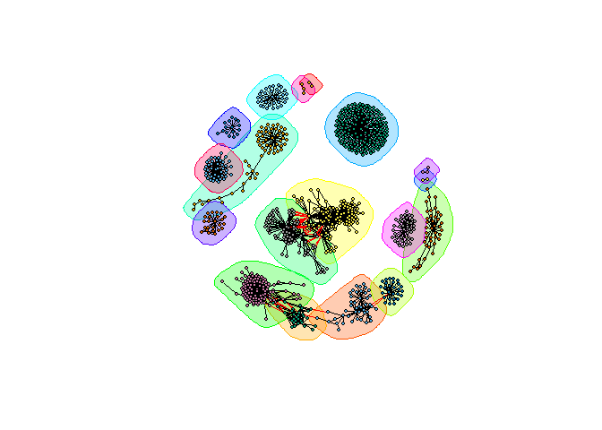
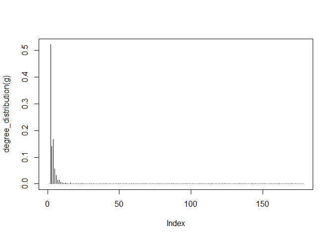
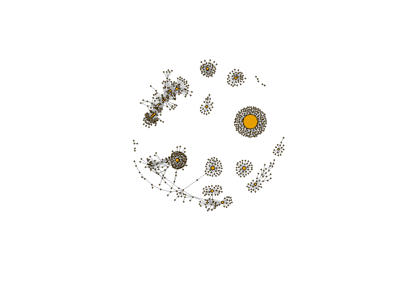
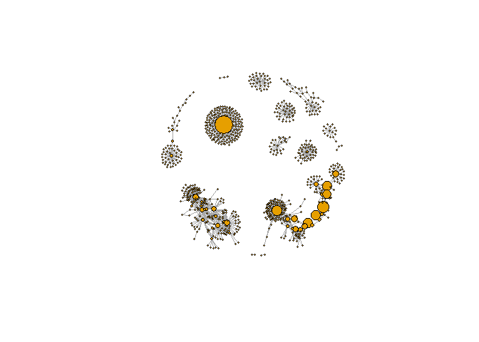

BGGN\_213\_class17
================

First Use of RCy3
=================

    ## Loading required package: graph

    ## Loading required package: BiocGenerics

    ## Loading required package: parallel

    ## 
    ## Attaching package: 'BiocGenerics'

    ## The following objects are masked from 'package:parallel':
    ## 
    ##     clusterApply, clusterApplyLB, clusterCall, clusterEvalQ,
    ##     clusterExport, clusterMap, parApply, parCapply, parLapply,
    ##     parLapplyLB, parRapply, parSapply, parSapplyLB

    ## The following objects are masked from 'package:stats':
    ## 
    ##     IQR, mad, sd, var, xtabs

    ## The following objects are masked from 'package:base':
    ## 
    ##     anyDuplicated, append, as.data.frame, cbind, colMeans,
    ##     colnames, colSums, do.call, duplicated, eval, evalq, Filter,
    ##     Find, get, grep, grepl, intersect, is.unsorted, lapply,
    ##     lengths, Map, mapply, match, mget, order, paste, pmax,
    ##     pmax.int, pmin, pmin.int, Position, rank, rbind, Reduce,
    ##     rowMeans, rownames, rowSums, sapply, setdiff, sort, table,
    ##     tapply, union, unique, unsplit, which, which.max, which.min

    ## [1] "type"
    ## [1] "lfc"
    ## [1] "label"
    ## [1] "count"
    ## [1] "edgeType"
    ## [1] "score"
    ## [1] "misc"
    ## Successfully set rule.
    ## Successfully set rule.
    ## Locked node dimensions successfully even if the check box is not ticked.
    ## Locked node dimensions successfully even if the check box is not ticked.
    ## Successfully set rule.
    ## Successfully set rule.

``` r
layoutNetwork(cwd, 'force-directed')

possible.layout.names <- getLayoutNames(cwd)
layoutNetwork (cwd, possible.layout.names[1])
# Test the connection to Cytoscape.
ping(cwd)
```

    ## [1] "It works!"

Can Save and Include Image
==========================

``` r
saveImage(cwd,
          file.name="demo",
          image.type="png",
          h=350)
```

``` r
#streamline of:
#library(knitr)
#include_graphics("./demo.png")

knitr::include_graphics("./demo.png")
```

 \#Change Styles

``` r
setVisualStyle(cwd, "Marquee")
```

    ## network visual style has been set to "Marquee"

``` r
saveImage(cwd,
          file.name="demo_marquee",
          image.type="png",
          h=350)
```

``` r
knitr::include_graphics("./demo_marquee.png")
```


``` r
styles <- getVisualStyleNames(cwd)
styles
```

    ##  [1] "Nested Network Style" "Sample3"              "Solid"               
    ##  [4] "Marquee"              "Ripple"               "Sample2"             
    ##  [7] "Directed"             "Curved"               "Minimal"             
    ## [10] "default black"        "BioPAX_SIF"           "Big Labels"          
    ## [13] "default"              "Sample1"              "BioPAX"              
    ## [16] "Gradient1"            "Universe"             "size_rank"

Metagenomics Data
=================

``` r
## scripts for processing located in "inst/data-raw/"
prok_vir_cor <- read.delim("./data/virus_prok_cor_abundant.tsv", stringsAsFactors = FALSE)

## Have a peak at the first 6 rows
head(prok_vir_cor)
```

    ##       Var1          Var2    weight
    ## 1  ph_1061 AACY020068177 0.8555342
    ## 2  ph_1258 AACY020207233 0.8055750
    ## 3  ph_3164 AACY020207233 0.8122517
    ## 4  ph_1033 AACY020255495 0.8487498
    ## 5 ph_10996 AACY020255495 0.8734617
    ## 6 ph_11038 AACY020255495 0.8740782

    ## 
    ## Attaching package: 'igraph'

    ## The following objects are masked from 'package:graph':
    ## 
    ##     degree, edges, intersection, union

    ## The following objects are masked from 'package:BiocGenerics':
    ## 
    ##     normalize, union

    ## The following objects are masked from 'package:stats':
    ## 
    ##     decompose, spectrum

    ## The following object is masked from 'package:base':
    ## 
    ##     union

    ## [1] "igraph"

``` r
g
```

    ## IGRAPH 9633408 UNW- 845 1544 -- 
    ## + attr: name (v/c), weight (e/n)
    ## + edges from 9633408 (vertex names):
    ##  [1] ph_1061 --AACY020068177 ph_1258 --AACY020207233
    ##  [3] ph_3164 --AACY020207233 ph_1033 --AACY020255495
    ##  [5] ph_10996--AACY020255495 ph_11038--AACY020255495
    ##  [7] ph_11040--AACY020255495 ph_11048--AACY020255495
    ##  [9] ph_11096--AACY020255495 ph_1113 --AACY020255495
    ## [11] ph_1208 --AACY020255495 ph_13207--AACY020255495
    ## [13] ph_1346 --AACY020255495 ph_14679--AACY020255495
    ## [15] ph_1572 --AACY020255495 ph_16045--AACY020255495
    ## + ... omitted several edges

Forming Graph

``` r
plot(g)
```



``` r
plot(g, vertex.label=NA)
```



``` r
plot(g, vertex.size=3, vertex.label=NA)
```

 \#Network Community Detection

``` r
cb <- cluster_edge_betweenness(g)
```

    ## Warning in cluster_edge_betweenness(g): At community.c:460 :Membership
    ## vector will be selected based on the lowest modularity score.

    ## Warning in cluster_edge_betweenness(g): At community.c:467 :Modularity
    ## calculation with weighted edge betweenness community detection might not
    ## make sense -- modularity treats edge weights as similarities while edge
    ## betwenness treats them as distances

``` r
cb
```

    ## IGRAPH clustering edge betweenness, groups: 18, mod: 0.82
    ## + groups:
    ##   $`1`
    ##   [1] "ph_1061"       "AACY020068177"
    ##   
    ##   $`2`
    ##    [1] "ph_1258"       "ph_5861"       "ph_7172"       "ph_11569"     
    ##    [5] "ph_1291"       "ph_1600"       "ph_2702"       "ph_5790"      
    ##    [9] "ph_5858"       "ph_7594"       "ph_7816"       "ph_784"       
    ##   [13] "ph_1359"       "ph_1534"       "ph_1874"       "ph_2465"      
    ##   [17] "ph_5453"       "ph_900"        "ph_908"        "ph_811"       
    ##   [21] "ph_1367"       "ph_1452"       "ph_1458"       "ph_1723"      
    ##   + ... omitted several groups/vertices

``` r
plot(cb, y=g, vertex.label=NA,  vertex.size=3)
```

 You can extract a cluster/community membership vector for further inspection with the membership() function:

``` r
head( membership(cb) )
```

    ##  ph_1061  ph_1258  ph_3164  ph_1033 ph_10996 ph_11038 
    ##        1        2        3        4        4        4

Node Degree
===========

Note again the scale-free nature of this network with a small number of nodes with high degree values and many nodes with low degree values.

``` r
# Calculate and plot node degree of our network
d <- degree(g)
hist(d, breaks=30, col="lightblue", main ="Node Degree Distribution")
```


``` r
plot( degree_distribution(g), type="h" )
```

 \#Centrality Analysis

``` r
pr <- page_rank(g)
head(pr$vector)
```

    ##      ph_1061      ph_1258      ph_3164      ph_1033     ph_10996 
    ## 0.0011834320 0.0011599483 0.0019042088 0.0005788564 0.0005769663 
    ##     ph_11038 
    ## 0.0005745460

``` r
# Make a size vector btwn 2 and 20 for node plotting size
v.size <- BBmisc::normalize(pr$vector, range=c(2,20), method="range")
plot(g, vertex.size=v.size, vertex.label=NA)
```



``` r
v.size <- BBmisc::normalize(d, range=c(2,20), method="range")
plot(g, vertex.size=v.size, vertex.label=NA)
```


``` r
b <- betweenness(g)
v.size <- BBmisc::normalize(b, range=c(2,20), method="range")
plot(g, vertex.size=v.size, vertex.label=NA)
```

 \#Read taxonomic classification for network annotation

``` r
phage_id_affiliation <- read.delim("./data/phage_ids_with_affiliation.tsv")
head(phage_id_affiliation)
```

    ##   first_sheet.Phage_id first_sheet.Phage_id_network phage_affiliation
    ## 1        109DCM_115804                       ph_775              <NA>
    ## 2        109DCM_115804                       ph_775              <NA>
    ## 3        109DCM_115804                       ph_775              <NA>
    ## 4        109DCM_115804                       ph_775              <NA>
    ## 5        109DCM_115804                       ph_775              <NA>
    ## 6        109DCM_115804                       ph_775              <NA>
    ##   Domain DNA_or_RNA Tax_order Tax_subfamily Tax_family Tax_genus
    ## 1   <NA>       <NA>      <NA>          <NA>       <NA>      <NA>
    ## 2   <NA>       <NA>      <NA>          <NA>       <NA>      <NA>
    ## 3   <NA>       <NA>      <NA>          <NA>       <NA>      <NA>
    ## 4   <NA>       <NA>      <NA>          <NA>       <NA>      <NA>
    ## 5   <NA>       <NA>      <NA>          <NA>       <NA>      <NA>
    ## 6   <NA>       <NA>      <NA>          <NA>       <NA>      <NA>
    ##   Tax_species
    ## 1        <NA>
    ## 2        <NA>
    ## 3        <NA>
    ## 4        <NA>
    ## 5        <NA>
    ## 6        <NA>

``` r
bac_id_affi <- read.delim("./data/prok_tax_from_silva.tsv", stringsAsFactors = FALSE)
head(bac_id_affi)
```

    ##    Accession_ID  Kingdom         Phylum          Class             Order
    ## 1 AACY020068177 Bacteria    Chloroflexi   SAR202 clade marine metagenome
    ## 2 AACY020125842  Archaea  Euryarchaeota Thermoplasmata Thermoplasmatales
    ## 3 AACY020187844  Archaea  Euryarchaeota Thermoplasmata Thermoplasmatales
    ## 4 AACY020105546 Bacteria Actinobacteria Actinobacteria             PeM15
    ## 5 AACY020281370  Archaea  Euryarchaeota Thermoplasmata Thermoplasmatales
    ## 6 AACY020147130  Archaea  Euryarchaeota Thermoplasmata Thermoplasmatales
    ##              Family             Genus Species
    ## 1              <NA>              <NA>    <NA>
    ## 2   Marine Group II marine metagenome    <NA>
    ## 3   Marine Group II marine metagenome    <NA>
    ## 4 marine metagenome              <NA>    <NA>
    ## 5   Marine Group II marine metagenome    <NA>
    ## 6   Marine Group II marine metagenome    <NA>

Add taxonomic annotation data to network

``` r
## Extract out our vertex names
genenet.nodes <- as.data.frame(vertex.attributes(g), stringsAsFactors=FALSE)
head(genenet.nodes)
```

    ##       name
    ## 1  ph_1061
    ## 2  ph_1258
    ## 3  ph_3164
    ## 4  ph_1033
    ## 5 ph_10996
    ## 6 ph_11038

How may phage (i.e. ph\_) entries do we have?

``` r
length( grep("^ph_",genenet.nodes[,1]) )
```

    ## [1] 764

``` r
# We dont need all annotation data so lets make a reduced table 'z' for merging
z <- bac_id_affi[,c("Accession_ID", "Kingdom", "Phylum", "Class")]
n <- merge(genenet.nodes, z, by.x="name", by.y="Accession_ID", all.x=TRUE)
head(n)
```

    ##            name  Kingdom          Phylum               Class
    ## 1 AACY020068177 Bacteria     Chloroflexi        SAR202 clade
    ## 2 AACY020207233 Bacteria Deferribacteres     Deferribacteres
    ## 3 AACY020255495 Bacteria  Proteobacteria Gammaproteobacteria
    ## 4 AACY020288370 Bacteria  Actinobacteria      Acidimicrobiia
    ## 5 AACY020396101 Bacteria  Actinobacteria      Acidimicrobiia
    ## 6 AACY020398456 Bacteria  Proteobacteria Gammaproteobacteria

``` r
# Check on the column names before deciding what to merge
colnames(n)
```

    ## [1] "name"    "Kingdom" "Phylum"  "Class"

``` r
colnames(phage_id_affiliation)
```

    ##  [1] "first_sheet.Phage_id"         "first_sheet.Phage_id_network"
    ##  [3] "phage_affiliation"            "Domain"                      
    ##  [5] "DNA_or_RNA"                   "Tax_order"                   
    ##  [7] "Tax_subfamily"                "Tax_family"                  
    ##  [9] "Tax_genus"                    "Tax_species"

``` r
# Again we only need a subset of `phage_id_affiliation` for our purposes
y <- phage_id_affiliation[, c("first_sheet.Phage_id_network", "phage_affiliation","Tax_order", "Tax_subfamily")]

# Add the little phage annotation that we have
x <- merge(x=n, y=y, by.x="name", by.y="first_sheet.Phage_id_network", all.x=TRUE)

## Remove duplicates from multiple matches
x <- x[!duplicated( (x$name) ),]
head(x)
```

    ##            name  Kingdom          Phylum               Class
    ## 1 AACY020068177 Bacteria     Chloroflexi        SAR202 clade
    ## 2 AACY020207233 Bacteria Deferribacteres     Deferribacteres
    ## 3 AACY020255495 Bacteria  Proteobacteria Gammaproteobacteria
    ## 4 AACY020288370 Bacteria  Actinobacteria      Acidimicrobiia
    ## 5 AACY020396101 Bacteria  Actinobacteria      Acidimicrobiia
    ## 6 AACY020398456 Bacteria  Proteobacteria Gammaproteobacteria
    ##   phage_affiliation Tax_order Tax_subfamily
    ## 1              <NA>      <NA>          <NA>
    ## 2              <NA>      <NA>          <NA>
    ## 3              <NA>      <NA>          <NA>
    ## 4              <NA>      <NA>          <NA>
    ## 5              <NA>      <NA>          <NA>
    ## 6              <NA>      <NA>          <NA>

Save our merged annotation results back to genenet.nodes.

``` r
genenet.nodes <- x
```

Add to the network the data related to the connections between the organisms, the edge data, and then prepare to send the nodes and edges to Cytoscape using the function cyPlot().

``` r
genenet.edges <- data.frame(igraph::as_edgelist(g))
names(genenet.edges) <- c("name.1",
                          "name.2")
genenet.edges$Weight <- igraph::edge_attr(g)[[1]]

genenet.edges$name.1 <- as.character(genenet.edges$name.1)
genenet.edges$name.2 <- as.character(genenet.edges$name.2)
genenet.nodes$name <- as.character(genenet.nodes$name)

ug <- cyPlot(genenet.nodes,genenet.edges)
```

Send network to Cytoscape using RCy3
====================================

``` r
# Open a new connection and delete any existing windows/networks in Cy
cy <- CytoscapeConnection()
deleteAllWindows(cy)
```

``` r
cw <- CytoscapeWindow("Tara oceans",
                      graph = ug,
                      overwriteWindow = TRUE)
```

``` r
displayGraph(cw)
```

    ## [1] "Kingdom"
    ## [1] "Phylum"
    ## [1] "Class"
    ## [1] "phage_affiliation"
    ## [1] "Tax_order"
    ## [1] "Tax_subfamily"
    ## [1] "label"
    ## [1] "Weight"

``` r
layoutNetwork(cw)
fitContent(cw)
```

Colour network by prokaryotic phylum

``` r
families_to_colour <- unique(genenet.nodes$Phylum)
families_to_colour <- families_to_colour[!is.na(families_to_colour)]

node.colour <- RColorBrewer::brewer.pal(length(families_to_colour), "Set3")

setNodeColorRule(cw,
                 "Phylum",
                 families_to_colour,
                 node.colour,
                 "lookup",
                 default.color = "#ffffff")
```

    ## Successfully set rule.

``` r
saveImage(cw,
          file.name="net2",
          image.type="png",
          h=350)
```

``` r
knitr::include_graphics("./net2.png")
```

 Set node shape to reflect virus or prokaryote

``` r
shapes_for_nodes <- c("DIAMOND")

phage_names <- grep("ph_",
                    genenet.nodes$name,
                    value = TRUE)
setNodeShapeRule(cw,
                 "label",
                 phage_names,
                 shapes_for_nodes)
```

    ## Successfully set rule.

``` r
displayGraph(cw)
```

    ## [1] "Kingdom"
    ## [1] "Phylum"
    ## [1] "Class"
    ## [1] "phage_affiliation"
    ## [1] "Tax_order"
    ## [1] "Tax_subfamily"
    ## [1] "label"
    ## [1] "Weight"

``` r
fitContent(cw)
```

Colour edges of phage nodes

``` r
setDefaultNodeBorderWidth(cw, 5)
families_to_colour <- c("Podoviridae",
                        "Siphoviridae",
                        "Myoviridae")

node.colour <- RColorBrewer::brewer.pal(length(families_to_colour),
                          "Dark2")
setNodeBorderColorRule(cw,
                       "Tax_subfamily",
                       families_to_colour,
                       node.colour,
                       "lookup", 
                       default.color = "#000000")
```

    ## Successfully set rule.

``` r
displayGraph(cw)
```

    ## [1] "Kingdom"
    ## [1] "Phylum"
    ## [1] "Class"
    ## [1] "phage_affiliation"
    ## [1] "Tax_order"
    ## [1] "Tax_subfamily"
    ## [1] "label"
    ## [1] "Weight"

``` r
fitContent(cw)
```

``` r
saveImage(cw,
          "co-occur2",
          "png",
          h=350)
```

``` r
knitr::include_graphics("co-occur2.png")
```

 Use a network layout to minimize the overlap of nodes.

``` r
getLayoutNames(cw)
```

    ##  [1] "attribute-circle"      "stacked-node-layout"  
    ##  [3] "degree-circle"         "circular"             
    ##  [5] "attributes-layout"     "kamada-kawai"         
    ##  [7] "force-directed"        "cose"                 
    ##  [9] "grid"                  "hierarchical"         
    ## [11] "fruchterman-rheingold" "isom"                 
    ## [13] "force-directed-cl"

``` r
getLayoutPropertyNames(cw, layout.name="force-directed")
```

    ## [1] "numIterations"            "defaultSpringCoefficient"
    ## [3] "defaultSpringLength"      "defaultNodeMass"         
    ## [5] "isDeterministic"          "singlePartition"

``` r
getLayoutPropertyValue(cw, "force-directed", "defaultSpringLength") 
```

    ## [1] 50

``` r
getLayoutPropertyValue(cw, "force-directed", "numIterations")
```

    ## [1] 100

``` r
layoutNetwork(cw, layout.name = "force-directed")
fitContent(cw)

saveImage(cw,
          "force-directed",
          "png",
          h=350)
```

``` r
knitr::include_graphics("force-directed.png")
```

 \#Look at network properties

``` r
## initiate a new node attribute
ug2 <- initNodeAttribute(graph = ug,
                          "degree",
                          "numeric",
                          0.0) 

## Use the igraph to calculate degree from the original graph
nodeData(ug2, nodes(ug2), "degree") <- igraph::degree(g)

cw2 <- CytoscapeWindow("Tara oceans with degree",
                      graph = ug2,
                      overwriteWindow = TRUE)
```

``` r
displayGraph(cw2)
```

    ## [1] "Kingdom"
    ## [1] "Phylum"
    ## [1] "Class"
    ## [1] "phage_affiliation"
    ## [1] "Tax_order"
    ## [1] "Tax_subfamily"
    ## [1] "degree"
    ## [1] "label"
    ## [1] "Weight"

``` r
layoutNetwork(cw2)
```

Size by degree

``` r
degree_control_points <- c(min(igraph::degree(g)),
                           mean(igraph::degree(g)),
                           max(igraph::degree(g)))
node_sizes <- c(20,
                20,
                80,
                100,
                110) # number of control points in interpolation mode,
                     # the first and the last are for sizes "below" and "above" the attribute seen.

setNodeSizeRule(cw2,
                "degree",
                degree_control_points,
                node_sizes,
                mode = "interpolate")
```

    ## Locked node dimensions successfully even if the check box is not ticked.
    ## Locked node dimensions successfully even if the check box is not ticked.
    ## Successfully set rule.

``` r
layoutNetwork(cw2,
              "force-directed")
```

``` r
saveImage(cw2,
          "degreesized_force-directed",
          "png",
          h=350)
```

``` r
knitr::include_graphics("degreesized_force-directed.png")
```


``` r
sessionInfo()
```

    ## R version 3.4.4 (2018-03-15)
    ## Platform: x86_64-w64-mingw32/x64 (64-bit)
    ## Running under: Windows 10 x64 (build 17134)
    ## 
    ## Matrix products: default
    ## 
    ## locale:
    ## [1] LC_COLLATE=English_United States.1252 
    ## [2] LC_CTYPE=English_United States.1252   
    ## [3] LC_MONETARY=English_United States.1252
    ## [4] LC_NUMERIC=C                          
    ## [5] LC_TIME=English_United States.1252    
    ## 
    ## attached base packages:
    ## [1] parallel  stats     graphics  grDevices utils     datasets  methods  
    ## [8] base     
    ## 
    ## other attached packages:
    ## [1] igraph_1.2.1        RCy3_1.8.0          graph_1.56.0       
    ## [4] BiocGenerics_0.24.0
    ## 
    ## loaded via a namespace (and not attached):
    ##  [1] Rcpp_0.12.16       knitr_1.20         magrittr_1.5      
    ##  [4] R6_2.2.2           stringr_1.3.0      httr_1.3.1        
    ##  [7] tools_3.4.4        checkmate_1.8.5    png_0.1-7         
    ## [10] htmltools_0.3.6    yaml_2.1.18        rprojroot_1.3-2   
    ## [13] digest_0.6.15      RJSONIO_1.3-0      RColorBrewer_1.1-2
    ## [16] bitops_1.0-6       RCurl_1.95-4.10    curl_3.2          
    ## [19] evaluate_0.10.1    rmarkdown_1.9      stringi_1.1.7     
    ## [22] compiler_3.4.4     BBmisc_1.11        backports_1.1.2   
    ## [25] stats4_3.4.4       pkgconfig_2.0.1
