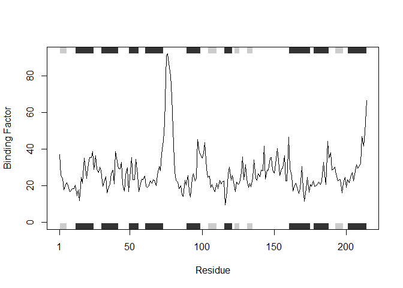

##Protein Binding Plot Making Function

```r
protein_binding_plot <- function(x){
  #Function plots the binding ability of specified protein
  #x = protein PDB code in ""
  
  #Needed to access the bio3d utilities(read.pdb, trim.pdb, and plotb3)
  library(bio3d)
  
  #Reads the online PDB file for protein x
  xread <- read.pdb(x)
  
  #Filters out PDB file for x to only access chain A and calpha "elety" (TRUE)
  xchain <- trim.pdb(xread, chain="A", elety="CA")
  
  #Line plots protein binding information found in atom info list, column b
  plotb3(xchain$atom$b, sse=xchain, typ="l", ylab="Binding Factor") }
```
##Function Test

```r
protein_binding_plot("1AKE")
```

```
##   Note: Accessing on-line PDB file
##    PDB has ALT records, taking A only, rm.alt=TRUE
```

<!-- -->

