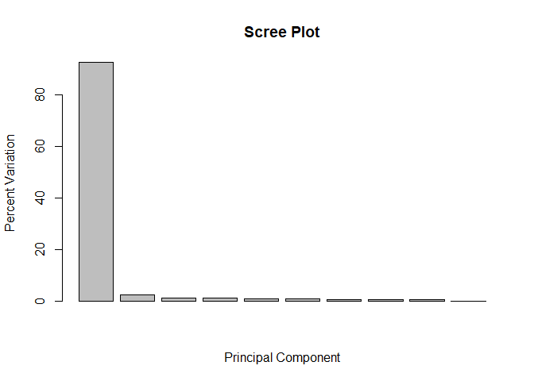
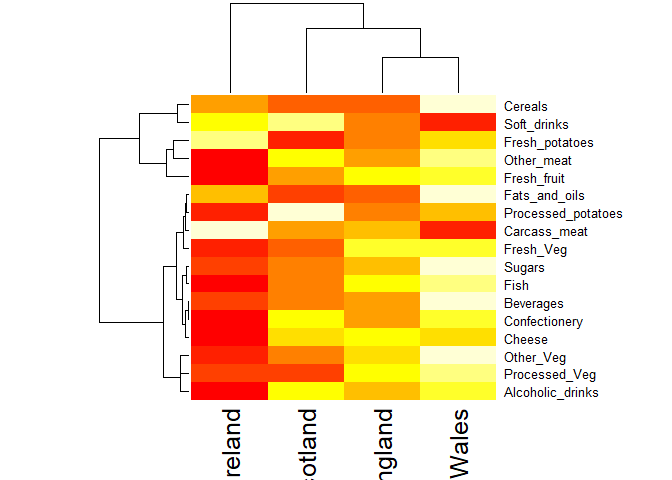

##K-means clustering example
testing kmeans() function

```r
tmp <- c(rnorm(30,-3), rnorm(30,3))
x <- cbind(x=tmp, y=rev(tmp))

plot(x)
```

<!-- -->
Use the kmeans() function setting k to 2 and nstart=20

```r
km <- kmeans(x, centers=2, nstart=20)
km
```

```
## K-means clustering with 2 clusters of sizes 30, 30
## 
## Cluster means:
##           x         y
## 1 -3.170808  3.233138
## 2  3.233138 -3.170808
## 
## Clustering vector:
##  [1] 1 1 1 1 1 1 1 1 1 1 1 1 1 1 1 1 1 1 1 1 1 1 1 1 1 1 1 1 1 1 2 2 2 2 2
## [36] 2 2 2 2 2 2 2 2 2 2 2 2 2 2 2 2 2 2 2 2 2 2 2 2 2
## 
## Within cluster sum of squares by cluster:
## [1] 41.19457 41.19457
##  (between_SS / total_SS =  93.7 %)
## 
## Available components:
## 
## [1] "cluster"      "centers"      "totss"        "withinss"    
## [5] "tot.withinss" "betweenss"    "size"         "iter"        
## [9] "ifault"
```

Inspect/print the results
Q. How many points are in each cluster?

```r
km$size
```

```
## [1] 30 30
```

Q. What ‘component’ of your result object details
 - cluster size?
 - cluster assignment/membership?
 - cluster center?

```r
km$cluster
```

```
##  [1] 1 1 1 1 1 1 1 1 1 1 1 1 1 1 1 1 1 1 1 1 1 1 1 1 1 1 1 1 1 1 2 2 2 2 2
## [36] 2 2 2 2 2 2 2 2 2 2 2 2 2 2 2 2 2 2 2 2 2 2 2 2 2
```
 cluster center

```r
km$centers
```

```
##           x         y
## 1 -3.170808  3.233138
## 2  3.233138 -3.170808
```
 
Plot x colored by the kmeans cluster assignment and
 add cluster centers as blue points

```r
plot(x, col=km$cluster, pch=16)
```

<!-- -->

```r
#points()
```
#hierarchical clustering
calculating point (dis)similarity as euclidean distance between observations

```r
dist_matrix <- dist(x)
```

```r
class(dist_matrix)
```

```
## [1] "dist"
```


```r
dim(as.matrix(dist_matrix))
```

```
## [1] 60 60
```


```r
hc <- hclust(d=dist_matrix)
```


```r
hc
```

```
## 
## Call:
## hclust(d = dist_matrix)
## 
## Cluster method   : complete 
## Distance         : euclidean 
## Number of objects: 60
```


```r
plot(hc)
```

<!-- -->
"cut" to define clusters

```r
plot(hc)
abline(h=6, col="red")
```

<!-- -->

```r
grps <- cutree(hc, h=6) # Cut by height h
table(grps)
```

```
## grps
##  1  2 
## 30 30
```


```r
plot(x, col=grps)
```

<!-- -->

```r
plot(x, col=cutree(hc, k=4))
```

<!-- -->
# Step 1. Generate some example data for clustering

```r
x <- rbind(
 matrix(rnorm(100, mean=0, sd = 0.3), ncol = 2), # c1
 matrix(rnorm(100, mean = 1, sd = 0.3), ncol = 2), # c2
 matrix(c(rnorm(50, mean = 1, sd = 0.3), # c3
 rnorm(50, mean = 0, sd = 0.3)), ncol = 2))
colnames(x) <- c("x", "y")
```

# Step 2. Plot the data without clustering

```r
plot(x)
```

<!-- -->
# Step 3. Generate colors for known clusters
# (just so we can compare to hclust results)

```r
col <- as.factor( rep(c("c1","c2","c3"), each=50) )
plot(x, col=col)
```

<!-- -->
Your Turn!
Q. Use the dist(), hclust(), plot() and cutree()
 functions to return 2 and 3 clusters 

```r
dist_matrix <- dist(x)
dim(as.matrix(dist_matrix))
```

```
## [1] 150 150
```

```r
hc <- hclust(d=dist_matrix)
plot(hc)
abline(h=1.5, col="red")
```

<!-- -->

```r
grps <- cutree(hc, h=1.5)
plot(x, col=grps)
```

<!-- -->
for 2 groups

```r
dist_matrix <- dist(x)
dim(as.matrix(dist_matrix))
```

```
## [1] 150 150
```

```r
hc <- hclust(d=dist_matrix)
plot(hc)
abline(h=2.5, col="red")
```

<!-- -->

```r
grps <- cutree(hc, h=2.5)
plot(x, col=grps)
```

<!-- -->
Principal Component Analysis

```r
mydata <- read.csv("https://tinyurl.com/expression-CSV",
 row.names=1) 
head(mydata)
```

```
##        wt1 wt2  wt3  wt4 wt5 ko1 ko2 ko3 ko4 ko5
## gene1  439 458  408  429 420  90  88  86  90  93
## gene2  219 200  204  210 187 427 423 434 433 426
## gene3 1006 989 1030 1017 973 252 237 238 226 210
## gene4  783 792  829  856 760 849 856 835 885 894
## gene5  181 249  204  244 225 277 305 272 270 279
## gene6  460 502  491  491 493 612 594 577 618 638
```

```r
pca <- prcomp(t(mydata), scale=TRUE) #PCAt9
attributes(pca)
```

```
## $names
## [1] "sdev"     "rotation" "center"   "scale"    "x"       
## 
## $class
## [1] "prcomp"
```
##PC1 vs PC2 plot

```r
plot(pca$x[,1], pca$x[,2]) 
```

<!-- -->
## Precent variance is often more informative to look at

```r
pca.var <- pca$sdev^2
pca.var.per <- round(pca.var/sum(pca.var)*100, 1)
pca.var.per
```

```
##  [1] 92.6  2.3  1.1  1.1  0.8  0.7  0.6  0.4  0.4  0.0
```

```r
barplot(pca.var.per, main="Scree Plot",
 xlab="Principal Component", ylab="Percent Variation")
```

<!-- -->
## A vector of colors for wt and ko samples

```r
#substr(x, start, stop) takes substrings from character vector
colvec <- as.factor( substr( colnames(mydata), 1, 2) ) 
colvec
```

```
##  [1] wt wt wt wt wt ko ko ko ko ko
## Levels: ko wt
```

```r
plot(pca$x[,1], pca$x[,2], col=colvec, pch=16,
 xlab=paste0("PC1 (", pca.var.per[1], "%)"),
 ylab=paste0("PC2 (", pca.var.per[2], "%)")) 
text(pca$x[,1], pca$x[,2], labels=colnames(mydata))
```

<!-- -->
#Worksheet

```r
x <- read.csv("UK_foods.csv")
dim(x)
```

```
## [1] 17  5
```

```r
head(x)
```

```
##                X England Wales Scotland N.Ireland
## 1         Cheese     105   103      103        66
## 2  Carcass_meat      245   227      242       267
## 3    Other_meat      685   803      750       586
## 4           Fish     147   160      122        93
## 5 Fats_and_oils      193   235      184       209
## 6         Sugars     156   175      147       139
```
##fix row names

```r
#can also do this with read.csv(row.names=1)
rownames(x) <- x[,1]
x <- x[,-1]
head(x)
```

```
##                England Wales Scotland N.Ireland
## Cheese             105   103      103        66
## Carcass_meat       245   227      242       267
## Other_meat         685   803      750       586
## Fish               147   160      122        93
## Fats_and_oils      193   235      184       209
## Sugars             156   175      147       139
```

```r
knitr::kable(x, caption="The full UK foods data table")
```


Table: The full UK foods data table

                      England   Wales   Scotland   N.Ireland
-------------------  --------  ------  ---------  ----------
Cheese                    105     103        103          66
Carcass_meat              245     227        242         267
Other_meat                685     803        750         586
Fish                      147     160        122          93
Fats_and_oils             193     235        184         209
Sugars                    156     175        147         139
Fresh_potatoes            720     874        566        1033
Fresh_Veg                 253     265        171         143
Other_Veg                 488     570        418         355
Processed_potatoes        198     203        220         187
Processed_Veg             360     365        337         334
Fresh_fruit              1102    1137        957         674
Cereals                  1472    1582       1462        1494
Beverages                  57      73         53          47
Soft_drinks              1374    1256       1572        1506
Alcoholic_drinks          375     475        458         135
Confectionery              54      64         62          41

```r
par(mar=c(10, 4, 4, 2))
heatmap(as.matrix(x))
```

<!-- -->
#PCA

```r
pca <- prcomp( t(x) )
summary(pca)
```

```
## Importance of components:
##                             PC1      PC2      PC3       PC4
## Standard deviation     324.1502 212.7478 73.87622 4.189e-14
## Proportion of Variance   0.6744   0.2905  0.03503 0.000e+00
## Cumulative Proportion    0.6744   0.9650  1.00000 1.000e+00
```

