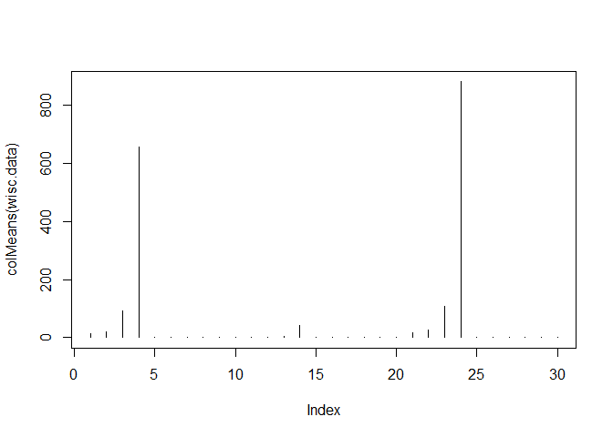
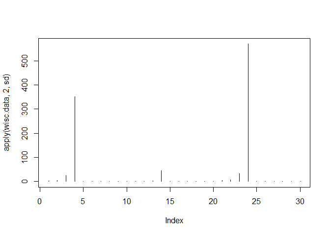
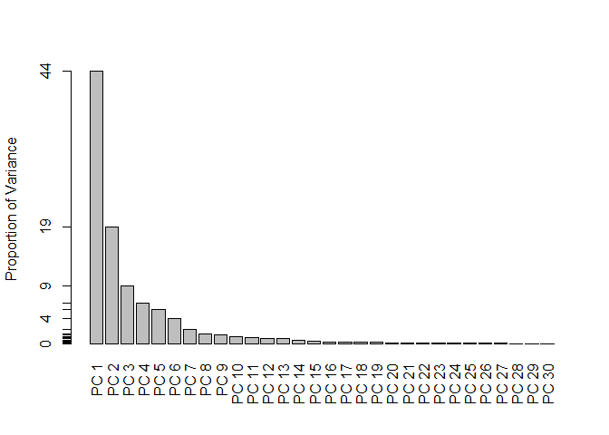
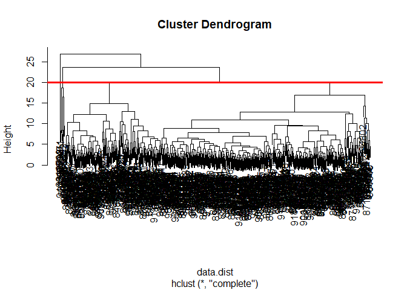
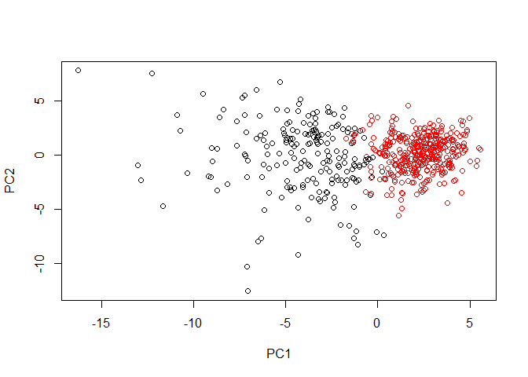
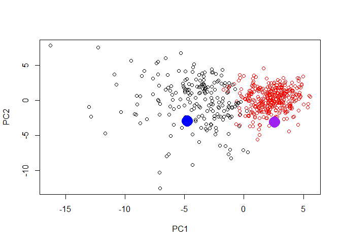

# Complete the following code to input the data and store as wisc.df

```r
url <- "https://bioboot.github.io/bggn213_S18/class-material/WisconsinCancer.csv"

wisc.df <- read.csv(url)
head(wisc.df)
```

```
##         id diagnosis radius_mean texture_mean perimeter_mean area_mean
## 1   842302         M       17.99        10.38         122.80    1001.0
## 2   842517         M       20.57        17.77         132.90    1326.0
## 3 84300903         M       19.69        21.25         130.00    1203.0
## 4 84348301         M       11.42        20.38          77.58     386.1
## 5 84358402         M       20.29        14.34         135.10    1297.0
## 6   843786         M       12.45        15.70          82.57     477.1
##   smoothness_mean compactness_mean concavity_mean concave.points_mean
## 1         0.11840          0.27760         0.3001             0.14710
## 2         0.08474          0.07864         0.0869             0.07017
## 3         0.10960          0.15990         0.1974             0.12790
## 4         0.14250          0.28390         0.2414             0.10520
## 5         0.10030          0.13280         0.1980             0.10430
## 6         0.12780          0.17000         0.1578             0.08089
##   symmetry_mean fractal_dimension_mean radius_se texture_se perimeter_se
## 1        0.2419                0.07871    1.0950     0.9053        8.589
## 2        0.1812                0.05667    0.5435     0.7339        3.398
## 3        0.2069                0.05999    0.7456     0.7869        4.585
## 4        0.2597                0.09744    0.4956     1.1560        3.445
## 5        0.1809                0.05883    0.7572     0.7813        5.438
## 6        0.2087                0.07613    0.3345     0.8902        2.217
##   area_se smoothness_se compactness_se concavity_se concave.points_se
## 1  153.40      0.006399        0.04904      0.05373           0.01587
## 2   74.08      0.005225        0.01308      0.01860           0.01340
## 3   94.03      0.006150        0.04006      0.03832           0.02058
## 4   27.23      0.009110        0.07458      0.05661           0.01867
## 5   94.44      0.011490        0.02461      0.05688           0.01885
## 6   27.19      0.007510        0.03345      0.03672           0.01137
##   symmetry_se fractal_dimension_se radius_worst texture_worst
## 1     0.03003             0.006193        25.38         17.33
## 2     0.01389             0.003532        24.99         23.41
## 3     0.02250             0.004571        23.57         25.53
## 4     0.05963             0.009208        14.91         26.50
## 5     0.01756             0.005115        22.54         16.67
## 6     0.02165             0.005082        15.47         23.75
##   perimeter_worst area_worst smoothness_worst compactness_worst
## 1          184.60     2019.0           0.1622            0.6656
## 2          158.80     1956.0           0.1238            0.1866
## 3          152.50     1709.0           0.1444            0.4245
## 4           98.87      567.7           0.2098            0.8663
## 5          152.20     1575.0           0.1374            0.2050
## 6          103.40      741.6           0.1791            0.5249
##   concavity_worst concave.points_worst symmetry_worst
## 1          0.7119               0.2654         0.4601
## 2          0.2416               0.1860         0.2750
## 3          0.4504               0.2430         0.3613
## 4          0.6869               0.2575         0.6638
## 5          0.4000               0.1625         0.2364
## 6          0.5355               0.1741         0.3985
##   fractal_dimension_worst  X
## 1                 0.11890 NA
## 2                 0.08902 NA
## 3                 0.08758 NA
## 4                 0.17300 NA
## 5                 0.07678 NA
## 6                 0.12440 NA
```
diagnosis cancer vs non-cancer

```r
table(wisc.df$diagnosis)
```

```
## 
##   B   M 
## 357 212
```
# Convert the features of the data: wisc.data, no id or diagnosis

```r
#column 33 all NA
wisc.data <- as.matrix(wisc.df[ ,-c(1:2, 33)])
```
# Set the row names of wisc.data

```r
row.names(wisc.data) <- wisc.df$id
head(wisc.data)
```

```
##          radius_mean texture_mean perimeter_mean area_mean smoothness_mean
## 842302         17.99        10.38         122.80    1001.0         0.11840
## 842517         20.57        17.77         132.90    1326.0         0.08474
## 84300903       19.69        21.25         130.00    1203.0         0.10960
## 84348301       11.42        20.38          77.58     386.1         0.14250
## 84358402       20.29        14.34         135.10    1297.0         0.10030
## 843786         12.45        15.70          82.57     477.1         0.12780
##          compactness_mean concavity_mean concave.points_mean symmetry_mean
## 842302            0.27760         0.3001             0.14710        0.2419
## 842517            0.07864         0.0869             0.07017        0.1812
## 84300903          0.15990         0.1974             0.12790        0.2069
## 84348301          0.28390         0.2414             0.10520        0.2597
## 84358402          0.13280         0.1980             0.10430        0.1809
## 843786            0.17000         0.1578             0.08089        0.2087
##          fractal_dimension_mean radius_se texture_se perimeter_se area_se
## 842302                  0.07871    1.0950     0.9053        8.589  153.40
## 842517                  0.05667    0.5435     0.7339        3.398   74.08
## 84300903                0.05999    0.7456     0.7869        4.585   94.03
## 84348301                0.09744    0.4956     1.1560        3.445   27.23
## 84358402                0.05883    0.7572     0.7813        5.438   94.44
## 843786                  0.07613    0.3345     0.8902        2.217   27.19
##          smoothness_se compactness_se concavity_se concave.points_se
## 842302        0.006399        0.04904      0.05373           0.01587
## 842517        0.005225        0.01308      0.01860           0.01340
## 84300903      0.006150        0.04006      0.03832           0.02058
## 84348301      0.009110        0.07458      0.05661           0.01867
## 84358402      0.011490        0.02461      0.05688           0.01885
## 843786        0.007510        0.03345      0.03672           0.01137
##          symmetry_se fractal_dimension_se radius_worst texture_worst
## 842302       0.03003             0.006193        25.38         17.33
## 842517       0.01389             0.003532        24.99         23.41
## 84300903     0.02250             0.004571        23.57         25.53
## 84348301     0.05963             0.009208        14.91         26.50
## 84358402     0.01756             0.005115        22.54         16.67
## 843786       0.02165             0.005082        15.47         23.75
##          perimeter_worst area_worst smoothness_worst compactness_worst
## 842302            184.60     2019.0           0.1622            0.6656
## 842517            158.80     1956.0           0.1238            0.1866
## 84300903          152.50     1709.0           0.1444            0.4245
## 84348301           98.87      567.7           0.2098            0.8663
## 84358402          152.20     1575.0           0.1374            0.2050
## 843786            103.40      741.6           0.1791            0.5249
##          concavity_worst concave.points_worst symmetry_worst
## 842302            0.7119               0.2654         0.4601
## 842517            0.2416               0.1860         0.2750
## 84300903          0.4504               0.2430         0.3613
## 84348301          0.6869               0.2575         0.6638
## 84358402          0.4000               0.1625         0.2364
## 843786            0.5355               0.1741         0.3985
##          fractal_dimension_worst
## 842302                   0.11890
## 842517                   0.08902
## 84300903                 0.08758
## 84348301                 0.17300
## 84358402                 0.07678
## 843786                   0.12440
```
# Create diagnosis vector by completing the missing code
#Q3. How many of the observations have a malignant diagnosis?

```r
diagnosis <- as.numeric(wisc.df$diagnosis=="M")
sum(diagnosis)
```

```
## [1] 212
```
Explore the data you created before (wisc.data and diagnosis) to answer the following questions:

The functions dim(), length(), grep() and sum() may be useful for answering the first 3 questions above.
#Q1. How many observations are in this dataset?

```r
#can also look at dim()[1]
nrow(wisc.data)
```

```
## [1] 569
```
#Q2. How many variables/features in the data are suffixed with _mean?

```r
length(grep("_mean", colnames(wisc.data), value=TRUE))
```

```
## [1] 10
```

```r
grep("_mean", colnames(wisc.data), value=TRUE, invert=TRUE)
```

```
##  [1] "radius_se"               "texture_se"             
##  [3] "perimeter_se"            "area_se"                
##  [5] "smoothness_se"           "compactness_se"         
##  [7] "concavity_se"            "concave.points_se"      
##  [9] "symmetry_se"             "fractal_dimension_se"   
## [11] "radius_worst"            "texture_worst"          
## [13] "perimeter_worst"         "area_worst"             
## [15] "smoothness_worst"        "compactness_worst"      
## [17] "concavity_worst"         "concave.points_worst"   
## [19] "symmetry_worst"          "fractal_dimension_worst"
```
It is important to check if the data need to be scaled before performing PCA. Recall two common reasons for scaling data include:

The input variables use different units of measurement.
The input variables have significantly different variances.
Check the mean and standard deviation of the features (i.e. columns) of the wisc.data to determine if the data should be scaled. Use the  colMeans() and apply() functions like you’ve done before.
# Check column means and standard deviations

```r
plot(colMeans(wisc.data), type="h")
```

<!-- -->


```r
plot(apply(wisc.data,2,sd), type="h")
```

<!-- -->
# Perform PCA on wisc.data by completing the following code

```r
wisc.pr <- prcomp(wisc.data, scale=TRUE)
summary(wisc.pr)
```

```
## Importance of components:
##                           PC1    PC2     PC3     PC4     PC5     PC6
## Standard deviation     3.6444 2.3857 1.67867 1.40735 1.28403 1.09880
## Proportion of Variance 0.4427 0.1897 0.09393 0.06602 0.05496 0.04025
## Cumulative Proportion  0.4427 0.6324 0.72636 0.79239 0.84734 0.88759
##                            PC7     PC8    PC9    PC10   PC11    PC12
## Standard deviation     0.82172 0.69037 0.6457 0.59219 0.5421 0.51104
## Proportion of Variance 0.02251 0.01589 0.0139 0.01169 0.0098 0.00871
## Cumulative Proportion  0.91010 0.92598 0.9399 0.95157 0.9614 0.97007
##                           PC13    PC14    PC15    PC16    PC17    PC18
## Standard deviation     0.49128 0.39624 0.30681 0.28260 0.24372 0.22939
## Proportion of Variance 0.00805 0.00523 0.00314 0.00266 0.00198 0.00175
## Cumulative Proportion  0.97812 0.98335 0.98649 0.98915 0.99113 0.99288
##                           PC19    PC20   PC21    PC22    PC23   PC24
## Standard deviation     0.22244 0.17652 0.1731 0.16565 0.15602 0.1344
## Proportion of Variance 0.00165 0.00104 0.0010 0.00091 0.00081 0.0006
## Cumulative Proportion  0.99453 0.99557 0.9966 0.99749 0.99830 0.9989
##                           PC25    PC26    PC27    PC28    PC29    PC30
## Standard deviation     0.12442 0.09043 0.08307 0.03987 0.02736 0.01153
## Proportion of Variance 0.00052 0.00027 0.00023 0.00005 0.00002 0.00000
## Cumulative Proportion  0.99942 0.99969 0.99992 0.99997 1.00000 1.00000
```
Q4. From your results, what proportion of the original variance is captured by the first principal components (PC1)?
Q5. How many principal components (PCs) are required to describe at least 70% of the original variance in the data?
Q6. How many principal components (PCs) are required to describe at least 90% of the original variance in the data?
#PCA result plots

```r
plot(wisc.pr$x[ ,1], wisc.pr$x[ ,2], col=diagnosis+1)
```

<!-- -->
Calculate the variance of each principal component by squaring the sdev component of wisc.pr (i.e. wisc.pr$sdev^2). Save the result as an object called pr.var.

Calculate the variance explained by each principal component by dividing by the total variance explained of all principal components. Assign this to a variable called pve and create a plot of variance explained for each principal component.

```r
# Variance explained by each principal component: pve
pve <- wisc.pr$sdev^2/sum(wisc.pr$sdev^2)
# Plot variance explained for each principal component
plot(pve, xlab = "Principal Component", 
     ylab = "Proportion of Variance Explained", 
     ylim = c(0, 1), type = "o")
```

<!-- -->
#barplot version

```r
barplot(pve, names.arg=paste("PC", 1:length(pve)), las=2, axes=FALSE, ylab="Proportion of Variance")
axis(2, at=pve, labels=round(pve,2)*100 )
```

<!-- -->
#hiearchial clustering
# Scale the wisc.data data: data.scaled

```r
data.scaled <- scale(wisc.data)
data.dist <- dist(data.scaled) #default= method = "euclidean"
wisc.hclust <- hclust(data.dist) #default= method="complete"

plot(wisc.hclust)
abline(h=20, col="red", lwd=3)
```

<!-- -->


```r
wisc.hclust.clusters <- cutree(wisc.hclust, k=4)

table(wisc.hclust.clusters, diagnosis)
```

```
##                     diagnosis
## wisc.hclust.clusters   0   1
##                    1  12 165
##                    2   2   5
##                    3 343  40
##                    4   0   2
```
#kmeans
Create a k-means model on wisc.data, assigning the result to wisc.km. Be sure to create 2 clusters, corresponding to the actual number of diagnosis. Also, remember to scale the data (with the scale() function and repeat the algorithm 20 times (by setting setting the value of the  nstart argument appropriately). Running multiple times such as this will help to find a well performing model.

```r
data.scaled <- scale(wisc.data)
wisc.km <- kmeans(data.scaled, centers=2, nstart=20)

table(wisc.km$cluster)
```

```
## 
##   1   2 
## 189 380
```
compare to expert diagnosis

```r
table(wisc.km$cluster, diagnosis)
```

```
##    diagnosis
##       0   1
##   1  14 175
##   2 343  37
```
#USing PCA info for clustering
Using the minimum number of principal components required to describe at least 90% of the variability in the data, create a hierarchical clustering model with complete linkage. Assign the results to wisc.pr.hclust.

## Use the distance along the first 3 PCs for clustering i.e. wisc.pr$x[, 1:3]

```r
wisc.pr.hclust <- hclust(dist(wisc.pr$x[, 1:3]), method="ward.D2")

plot(wisc.pr.hclust)
```

<!-- -->


```r
wisc.pr.hclust.clusters <- cutree(wisc.pr.hclust, k=2)

plot(wisc.pr$x[,1:2], col=wisc.pr.hclust.clusters)
```

<!-- -->

```r
table(wisc.pr.hclust.clusters, diagnosis)
```

```
##                        diagnosis
## wisc.pr.hclust.clusters   0   1
##                       1  24 179
##                       2 333  33
```
#Test Model

```r
url <- "https://tinyurl.com/new-samples-CSV"
new <- read.csv(url)
```

```r
npc <- predict(wisc.pr, newdata=new)
plot(wisc.pr$x[,1:2], col=wisc.pr.hclust.clusters)
points(npc[,1], npc[,2], col=c("purple", "blue"), pch=16, cex=3)
```

<!-- -->


